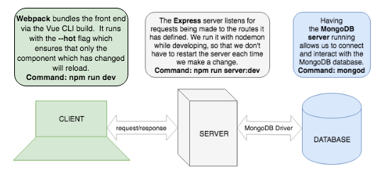

# Homework: Full Stack Games Hub App

### Learning Objectives

- Understand the relationship between client, server and database
- Be able to navigate a codebase that you haven't written

## Brief

Your boss has asked to you look over the codebase of a full-stack JavaScript application. The front-end is written in JavaScript using Vue, the back-end uses an Express server and a MongoDB database. Your task is to make yourself familiar with the codebase.

The application includes a README.md with instructions on running the application.

*Overview of the tech stack and tooling with commands*

## MVP

### Task

Draw a diagram showing the dataflow through the application starting with a form submission, ending with the re-rendering of the page. This will involve a multi-direction data-flow with the client posting data to the server and the server sending data back to the client with the response. Detail the client, server and database in the diagram and include the names of the files involved in the process.

### Questions

1. What is responsible for defining the routes of the `games` resource?

In Helpers we have a file create_router.js where our routes of games are defined, including what they do.

2. What do you notice about the folder structure?  Whats the client responsible for? Whats the server responsible for?

The client-server characteristic describes the relationship of cooperating programs in a app. the server component provides a function or serve to one or many clients, which initiates requests for such services. Servers are classified by the services they provide.

Client:
- main.js
-app.Vue
- src: components + assets + services(images)
-public photos

Server:
 - helpers/ routes
 - server.js
 json files
 - db seeds

3. What are the the responsibilities of server.js?
server.js is responsive for:
-connecting to the db
- app.use statements
declaring constants of plug ins required such as
express, parser and MongoClient

4. What are the responsibilities of the `gamesRouter`?
gamesRouter will be a function that takes in the gamescollection array(data). it is the function that we will export from the file. gamesRouter will create and export an express Router. we will require Express and inside the function invoke express.Router which returns the Router object.

it is reponsible also for stating the routes for the 'games'

5. What process does the the client (front-end) use to communicate with the server?

the front end sends a "fetch" request to the server via a route defined in gameRouter.

6. What optional second argument does the `fetch` method take? And what is it used for in this application? Hint: See [Using Fetch](https://developer.mozilla.org/en-US/docs/Web/API/Fetch_API/Using_Fetch) on the MDN docs

fetch can have a optional second parameter of an 'init' object, that allows you to control a numbner of settings.

in this example, we have a second parameter defining the method as post, in the body section we state the stringify property to ensure the data is send in the correct format and also header information.

7. Which of the games API routes does the front-end application consume (i.e. make requests to)?
get, post, delete, put.

8. What are we using the [MongoDB Driver](http://mongodb.github.io/node-mongodb-native/) for?

The MongoDB Node.js driver provides both callback-based and Promise-based interaction with MongoDB, allowing applications of the new features in ES6.

the driver also includes support for the shared CRUD API specification and the Server Discovery and Monitoring Specification.

## Extension

Why do we need to use [`ObjectId`](https://mongodb.github.io/node-mongodb-native/api-bson-generated/objectid.html) from the MongoDB driver?
It creates a special field used to make every object unique.

ObjectID: its a 12 byte length value created automatically by MondgoDb. this is performed when a new document has been inserted into the mongod.

Basically we need to use 'ObjectID' because we need a way of unique identifying each document in the database, Mongodb automatically creates one for us. 

Add to your diagram the dataflow for removing a game.
